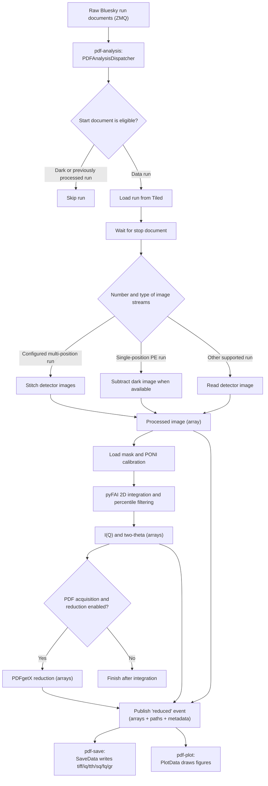

# pdf-auto

`pdf-auto` is the automatic area-detector data-reduction workflow used at the
NSLS-II PDF beamline. It listens for completed Bluesky runs over **ZMQ**,
retrieves the run from Tiled, processes the detector image, integrates the image
to one-dimensional data, and—when appropriate—performs PDF reduction. The
reduced results are re-published as a Bluesky **`reduced`** analysis stream that
separate processes consume to save files and draw plots.

This repository is intended primarily for colleagues who operate, maintain, or
debug the workflow on the beamline workstation.

> **This branch does not use Kafka.** The workflow is split into three ZMQ
> processes (analysis → save, plot). The former Kafka file-writing consumer was
> removed from this branch; that version is preserved on another branch.

## Architecture: three ZMQ processes

Reduction, file writing, and plotting run as three cooperating processes that
communicate through the beamline's Bluesky ZMQ proxies:

- **`pdf-analysis`** subscribes to the raw run-document stream, reduces each
  completed run (compute-only, no file I/O), and **publishes** a `reduced`
  event carrying the output arrays, target paths, and metadata inline.
- **`pdf-save`** subscribes to the `reduced` stream and writes the
  `.tiff`/`.iq`/`.xy`/`.sq`/`.fq`/`.gr` files.
- **`pdf-plot`** subscribes to the `reduced` stream and draws the interactive
  Matplotlib figures.

Running save and plot as their own processes keeps a slow or crashing GUI (or a
disk hiccup) from interfering with reduction. See
[Starting the workflow](#starting-the-workflow) for how to launch them.

## What the workflow produces

For a supported data run, the workflow can produce:

- a processed detector image (`.tiff`);
- integrated intensity as a function of momentum transfer (`.iq`);
- integrated intensity as a function of two-theta (`.xy`);
- `S(Q)`, `F(Q)`, and `G(r)` files for PDF acquisitions; and
- interactive Matplotlib views of the detector image, integration result, and
  PDF-reduction products.

Dark scans and runs that already contain `original_run_uid` are not processed.

## Processing flow



Processing is triggered by Bluesky documents, but the data reduction itself is
performed after the run's `stop` document is received. The dispatcher is
**compute-only**: it returns arrays (never writing files) and publishes them on
the `reduced` stream; `pdf-save` is the sole file writer and `pdf-plot` the sole
plotter.

## Beamline environment

The environment is defined in [`pixi.toml`](pixi.toml). It currently targets:

- Linux x86-64 (`linux-64`);
- Python 3.12;
- the NSLS-II Bluesky and Tiled infrastructure, driven over ZMQ;
- pyFAI for azimuthal integration; and
- PDFstream/PDFgetX for PDF reduction.

The absolute repository path and local PDFgetX wheel path in `pixi.toml` are
intentional. They correspond to the beamline workstation deployment and should
not be changed there unless that deployment or wheel location changes.

The workflow also expects:

- a working Tiled profile matching the beamline acronym, normally `pdf`;
- the beamline Bluesky ZMQ proxies (the `[LISTEN TO]` and `[PUBLISH TO]` sockets
  in [`pdf_auto_config.ini`](pdf_auto_config.ini));
- access to the configured NSLS-II data directories;
- detector masks and PONI calibration files; and
- a graphical session for the Qt/Matplotlib displays (`pdf-plot`).

## Installation

On the beamline workstation, from this repository:

```bash
pixi install
```

The first installation on the beamline workstation will generate a new
`pixi.lock` for this reduced environment. Commit that generated lock file after
the workflow has been validated there; the previous lock described the removed
multi-environment profile and is intentionally not retained.

## Starting the workflow

The workflow runs as three Pixi tasks, typically each in its own terminal.
Start the reduction dispatcher, plus the save and plot subscribers:

```bash
pixi run pdf-analysis   # reduce runs and publish the 'reduced' stream
pixi run pdf-save       # subscribe and write tiff/iq/tth/sq/fq/gr files
pixi run pdf-plot       # subscribe and draw interactive figures
```

The repository has one default Pixi environment. Each task runs the package with
the beamline source directory on `PYTHONPATH` and the Qt Matplotlib backend. For
example, `pdf-analysis` is equivalent to:

```bash
PYTHONPATH=/home/xf28id1/src/pdf-auto/src MPLBACKEND=qtagg python -m pdf_auto pdf
```

Here, `pdf` is the **Tiled profile name** used to load runs. `pdf-analysis`
listens on the ZMQ socket in the INI `[LISTEN TO]` section and publishes to the
`[PUBLISH TO]` proxy; `pdf-save` and `pdf-plot` subscribe to `[PUBLISH TO]`.

Stop any process with `Ctrl+C`.

After installing the package, the equivalent standard entry points are:

```bash
pdf-analysis pdf        # or: python -m pdf_auto pdf
pdf-save                # or: python -m pdf_auto save
pdf-plot                # or: python -m pdf_auto plot
```

`pdf-save` and `pdf-plot` take no beamline acronym; they only subscribe to the
published stream. All three accept `--config /path/to/config.ini`;
`pdf-analysis` also accepts `--zmq-address`/`--prefix` and the subscribers accept
`--host`/`--prefix` to override the INI sockets.

### Which INI is used

When `--config` is omitted, [`config.py`](src/pdf_auto/config.py) resolves the
INI in this order:

1. `--config /path/to/config.ini` (explicit);
2. the `PDF_AUTO_CONFIG` environment variable;
3. the beamline deployment path
   (`/home/xf28id1/src/pdf-auto/pdf_auto_config.ini`) **if it exists**; then
4. the template shipped inside the package
   ([`src/pdf_auto/data/pdf_auto_config.ini`](src/pdf_auto/data/pdf_auto_config.ini)).

The packaged template keeps the structural defaults and the conventional ZMQ
socket names, but its `[PATH]` roots are placeholders — a real deployment must
point at a populated INI via `--config` or `PDF_AUTO_CONFIG`. On the beamline
workstation the live INI at the repo root is selected automatically by step 3.

## Configuration

Runtime behavior is controlled by
[`pdf_auto_config.ini`](pdf_auto_config.ini). Its existing filesystem paths
are beamline deployment paths and should not be replaced with generic examples.

### `[topics]`

Defines the raw and analysis catalog names. These values are retained for the
beamline data model even though the entry point obtains its Tiled client from the
beamline profile.

### `[LISTEN TO]`

The ZMQ source `pdf-analysis` subscribes to for raw run documents:

- `zmq_address` is the proxy output socket to read from; and
- `prefix` is the `RemoteDispatcher` prefix filter (matches the raw publisher).

Override at runtime with `--zmq-address` / `--prefix`.

### `[PUBLISH TO]`

The ZMQ proxies for the re-published `reduced` stream. **Publish and subscribe
are different proxy sockets**, bridged upstream:

- `publish_host` — where `pdf-analysis` publishes the `reduced` documents;
- `subscribe_host` — where `pdf-save` and `pdf-plot` receive them; and
- `prefix` — the `reduced` stream prefix bytestring (must not contain a space).

Both sockets are the proxies' `out.sock` files (the publish side attaches to the
`pdf-tcp-in-ipc-out` proxy's out socket; the subscribe side reads the
`pdf-ipc-in-ipc-out` proxy's out socket). Do not collapse them into one address.
Subscribers override with `--host` / `--prefix`.

### `[PATH]`

Defines:

- the processed-data and configuration roots;
- detector-specific PDF, XRD, and SAXS calibration directories;
- masks for individual detector positions and stitched images;
- PONI geometry files; and
- optional flat-field images.

The mask and PONI filenames are resolved beneath `config_base`. The selected
calibration directory depends on the detector and acquisition mode.

### `[SUM]`

Controls image preprocessing and acquisition classification:

- `num_positions` is the number of streams expected for a stitched acquisition;
- `detector_Xmotor` and `detector_Ymotor` name the position fields used during
  stitching;
- `pixel_size` converts motor displacement to detector-pixel offsets;
- `use_flat_field_*` enables detector-specific flat-field correction;
- `PDF_limit` is the upper detector-distance boundary for PDF mode; and
- `SAXS_limit` separates XRD and SAXS modes.

With the current configuration, distance is interpreted as follows:

| Detector distance | Acquisition mode |
|---|---|
| Less than `PDF_limit` | PDF |
| Between `PDF_limit` and `SAXS_limit` | XRD |
| Greater than `SAXS_limit` | SAXS |

### `[INTEGRATION]`

Controls pyFAI integration:

- `npt_rad`: number of radial bins;
- `npt_azim`: number of azimuthal bins;
- `polarization`: polarization correction factor;
- `UNIT`: radial-axis unit; and
- `low_limit_pcfilter` / `up_limit_pcfilter`: percentile limits used to reject
  low and high outliers in each radial bin of the unrolled image.

### `[pdfgetx3]`

Controls conversion from `I(Q)` to PDF products:

- `do_reduction` enables or disables PDFgetX processing;
- `backgroundfile` and `bgscale` control background subtraction;
- `use_auto_bkg` optimizes the background scale when the background exists;
- `qmin`, `qmax`, and `qmaxinst` define the Q range;
- `rmin`, `rmax`, and `rstep` define the real-space output range; and
- `rpoly`, `dataformat`, and `outputtype` are passed to PDFgetX.

PDFgetX reduction is performed only when `do_reduction = True` and the run is
classified as PDF. If `backgroundfile` is empty or missing, the workflow reports
that no background exists and continues with the PDF transformation configuration.

### `[TEMPERATURE]`

`temp_controller` names the start-document field containing sample temperature.
If that field is available and numeric, the temperature and inferred unit are
included in output metadata and filenames. Missing temperature metadata does not
stop processing.

## Required run metadata

The workflow expects the following Bluesky start-document fields:

| Field | Use |
|---|---|
| `uid` | Locates the run in Tiled and identifies output files |
| `sample_name` | Selects the sample output directory and filename prefix |
| `detectors` | Selects detector-specific preprocessing and calibration |
| `sp_plan_name` | Identifies dark scans that should be skipped |
| `calibration_md.Distance` | Classifies the run as PDF, XRD, or SAXS |
| `calibration_md.Wavelength` | Converts Q to two-theta |
| `composition_string` | Supplies composition for PDFgetX reduction; currently required for reliable operation |
| `sc_dk_field_uid` | Optional UID of the dark run used for subtraction |
| configured temperature field | Optional temperature metadata |

The stop document must provide `num_events`; its stream names are used to locate
the image data and decide whether the acquisition should be stitched.

The code contains an intended `Ni1.0` fallback for a missing
`composition_string`, but the PDF configuration may be evaluated before that
fallback is reached. For reliable operation, provide a valid composition in the
run metadata and confirm it is scientifically correct for the sample.

## Output layout and filenames

Outputs are written by `pdf-save` below:

```text
<user_data>/<tiff_base>/<sample_name>/<detector>/
├── img/         # processed detector image (.tiff)
├── iq/          # I(Q) (.iq)
├── tth/         # two-theta (.xy)
├── sq/          # S(Q) (.sq)   PDF acquisitions only
├── fq/          # F(Q) (.fq)   PDF acquisitions only
└── gr/          # G(r) (.gr)   PDF acquisitions only
```

The PDFgetX products (`sq`/`fq`/`gr`) are written one per output type into their
own subdirectories. The base filename includes the sample name, acquisition
date/time, first six UID characters, and—when available—temperature. A suffix
records the image treatment:

- `_sum`: multi-position images were stitched;
- `_sub`: a single-position image was dark-subtracted, or exported directly when
  no dark UID was available; and
- `_flat`: flat-field correction was enabled.

The integration files include pyFAI configuration and run metadata in their
headers.

## Code map

The package (`src/pdf_auto/`) is grouped into subpackages by responsibility.

Top level:

| File | Responsibility |
|---|---|
| [`cli.py`](src/pdf_auto/cli.py) | Argument parsing and the `pdf-analysis`/`pdf-save`/`pdf-plot` entry points |
| [`__main__.py`](src/pdf_auto/__main__.py) | `python -m pdf_auto`: routes `save`/`plot`/else to the entry points |
| [`config.py`](src/pdf_auto/config.py) | Default INI path (beamline deployment) |

`reduction/` — the compute pipeline:

| File | Responsibility |
|---|---|
| [`image_processing.py`](src/pdf_auto/reduction/image_processing.py) | Configuration, Tiled run access, acquisition classification, dark subtraction, stitching, output paths |
| [`integration.py`](src/pdf_auto/reduction/integration.py) | Mask/calibration selection and pyFAI 2D-to-1D integration |
| [`reduction.py`](src/pdf_auto/reduction/reduction.py) | PDFgetX configuration, automatic background scaling, and PDF reduction (`PDFReducer`) |

`callbacks/` — the Bluesky ZMQ stream callbacks:

| File | Responsibility |
|---|---|
| [`live_dispatcher.py`](src/pdf_auto/callbacks/live_dispatcher.py) | `PDFAnalysisDispatcher` (compute + publish) and `run_analysis_stream_zmq` |
| [`save_data.py`](src/pdf_auto/callbacks/save_data.py) | `SaveData` file writer and `run_save_data_zmq` |
| [`plot_callback.py`](src/pdf_auto/callbacks/plot_callback.py) | `PlotData` figure callback and `run_plot_zmq` |
| [`analysis_stream.py`](src/pdf_auto/callbacks/analysis_stream.py) | Pure `reduced`-event payload builders (off-beamline-safe) |

`plotting/` — Matplotlib figures and widgets:

| File | Responsibility |
|---|---|
| [`plotting.py`](src/pdf_auto/plotting/plotting.py) | `ImagePlotter` high-level interactive plots |
| [`plot_widgets.py`](src/pdf_auto/plotting/plot_widgets.py) | Matplotlib sliders, buttons, ring-overlay tuners |

`core/` — shared helpers:

| File | Responsibility |
|---|---|
| [`routing.py`](src/pdf_auto/core/routing.py) | Service-independent decisions about which start documents to process |
| [`utilities.py`](src/pdf_auto/core/utilities.py) | Shared parsing, array, plotting, and background helpers |
| [`qt_kicker.py`](src/pdf_auto/core/qt_kicker.py) | Pumps the Qt event loop while the ZMQ asyncio loop runs (keeps plots interactive) |

The [`legacy/`](legacy/) directory contains dead reference code and older
replay/testing utilities. It is excluded from tooling and is not an entry point.

## Development

The repository now uses the Scientific Python `src/` package layout. Runtime
deployment remains managed by Pixi, while package metadata and developer-tool
configuration live in [`pyproject.toml`](pyproject.toml).

Install the package with test dependencies in an isolated Python 3.12
environment (`pip install -e '.[dev]'`), then run:

```bash
pytest
ruff check .
ruff format --check .
mypy
```

Tests marked `beamline` require the NSLS-II services, calibration assets, and
local PDFgetX wheel. The default test suite is offline and does not require those
resources. To keep it that way, the beamline-only dependencies (`bluesky`,
`tiled`, `pyFAI`, `diffpy.pdfgetx`, `pdfstream`) live in the `beamline` extra and
must only be imported inside `reduction/`, `plotting/`, and `callbacks/`
beamline modules — never at import time in `cli.py`, `config.py`, or the
`core/`/`analysis_stream.py` modules that the offline tests import.

### Repository support files

Two root-level files come from the Scientific Python development pattern. They
are not used when the beamline server is running:

- [`.pre-commit-config.yaml`](.pre-commit-config.yaml) runs Ruff formatting,
  linting, and basic file checks before a commit when a developer enables
  pre-commit. Keeping it helps prevent formatting and configuration mistakes.
- [`mkdocs.yml`](mkdocs.yml) configures the documentation site built from
  `docs/`. Keeping it makes the architecture and development documentation easy
  to preview or publish.

Both files should remain at the repository root by convention. They can be
removed without affecting beamline execution, but retaining them keeps the
repository aligned with the Scientific Python template.

## Troubleshooting

### `pdf-save` / `pdf-plot` receive nothing (only the startup banner)

The `reduced` documents are not reaching the subscribers. Check that:

- `pdf-analysis` is running and prints `[EMIT] dispatched ...` lines per run;
- the `[PUBLISH TO]` `publish_host` (where `pdf-analysis` publishes) and
  `subscribe_host` (where the subscribers read) point at the correct, distinct
  proxy sockets — using one socket for both, or the wrong proxy, silently drops
  everything; and
- the `prefix` matches on both sides.

The subscribers run their `RemoteDispatcher` with `strict=True`, so a genuine
deserialization failure raises loudly rather than being dropped.

### A run UID cannot be loaded

Verify that the Tiled profile exists and that the run is visible through that
profile. The `pdf-analysis` command-line acronym is used as the profile name.

### A mask or PONI file cannot be found

Check the detector name, acquisition mode, `config_base`, and the corresponding
mask/PONI entries in the INI file. Stitched acquisitions use the stitched mask and
merged PONI file; other acquisitions use detector- and mode-specific files.

### No dark image was subtracted

Dark subtraction requires `sc_dk_field_uid` in the run metadata. Without it, the
raw image is used and `pdf-analysis` prints a warning.

### PDF files were not generated

Confirm all of the following:

- the run was classified as PDF using `calibration_md.Distance`;
- `do_reduction = True`;
- the run has a valid `composition_string`, or the printed fallback is acceptable;
- the PDFgetX environment is available; and
- the background and Q/r settings are appropriate for the measurement.

### Plot windows appear but sliders/buttons do not respond

`pdf-plot` installs a Qt "kicker" ([`core/qt_kicker.py`](src/pdf_auto/core/qt_kicker.py))
that pumps the Qt event loop while the ZMQ `RemoteDispatcher` blocks the thread.
Interactivity depends on a functioning display and a **PySide6** installation
with the `qtagg` backend (set by the Pixi task). If widgets are dead, confirm the
Qt binding is importable and the process is running in a graphical session.

## Legacy

The `pdf-analysis`/`pdf-save`/`pdf-plot` processes are the active implementation.
The [`legacy/`](legacy/) directory holds dead reference code and older
replay/testing utilities; it is excluded from tooling and is not a production
entry point. The Kafka file-writing consumer that previously lived here was
removed from this branch and is preserved on a separate branch.
