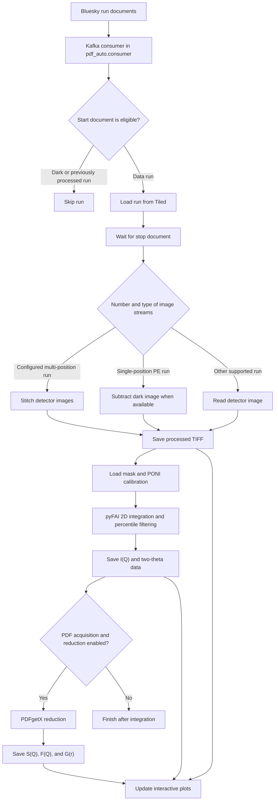

# pdf-auto

`pdf-auto` is the automatic area-detector data-reduction workflow used at the
NSLS-II PDF beamline. It listens for completed Bluesky runs, retrieves the run
from Tiled, processes the detector image, integrates the image to one-dimensional
data, and—when appropriate—performs PDF reduction.

This repository is intended primarily for colleagues who operate, maintain, or
debug the workflow on the beamline workstation.

## What the workflow produces

For a supported data run, the workflow can produce:

- a processed detector image (`.tiff`);
- integrated intensity as a function of momentum transfer (`.iq`);
- integrated intensity as a function of two-theta (`.xy`);
- `S(Q)`, `F(Q)`, and `G(r)` files for PDF acquisitions; and
- interactive Matplotlib views of the detector image, integration result, and
  PDF-reduction products.

Dark scans and runs that already contain `original_run_uid` are not processed.

## Processing flow



Processing is triggered by Bluesky documents, but the data reduction itself is
performed after the run's `stop` document is received. The active server uses a
unique Kafka consumer group on each launch, so it receives new documents without
sharing work with another consumer instance.

## Beamline environment

The environment is defined in [`pixi.toml`](pixi.toml) and locked by
[`pixi.lock`](pixi.lock). It currently targets:

- Linux x86-64 (`linux-64`);
- Python 3.12;
- the NSLS-II Bluesky, Kafka, and Tiled infrastructure;
- pyFAI for azimuthal integration; and
- PDFstream/PDFgetX for PDF reduction.

The absolute repository path and local PDFgetX wheel path in `pixi.toml` are
intentional. They correspond to the beamline workstation deployment and should
not be changed there unless that deployment or wheel location changes.

The workflow also expects:

- a working Tiled profile matching the beamline acronym, normally `pdf`;
- `/etc/bluesky/kafka.yml` with Kafka connection information;
- access to the configured NSLS-II data directories;
- detector masks and PONI calibration files; and
- a graphical session for the Qt/Matplotlib displays.

## Installation

On the beamline workstation, from this repository:

```bash
pixi install -e terminal
```

## Starting the active server

After installation, start the server with the `pdf_auto` Pixi task:

```bash
pixi run pdf_auto
```

The `pdf_auto` task belongs only to the `terminal` environment, so Pixi selects
that environment automatically when the task name is used. The task runs the
package with the beamline source directory on `PYTHONPATH`, equivalent to:

```bash
PYTHONPATH=/home/xf28id1/src/pdf-auto/src python -m pdf_auto pdf
```

Here, `pdf` is both the beamline acronym used to construct the Kafka topic and
the Tiled profile name used by the processing factory. The server subscribes to:

```text
pdf.bluesky.runengine.documents
```

Stop the consumer with `Ctrl+C`.

After installing the package, the equivalent standard entry points are:

```bash
pdf-auto pdf
python -m pdf_auto pdf
```

Use `--config /path/to/config.ini` to test another configuration while retaining
the beamline workstation path as the default.

The default INI path in [`config.py`](src/pdf_auto/config.py) is intentional for
the beamline workstation. It can be overridden with `--config` for testing or a
different deployment without changing the beamline default.

## Configuration

Runtime behavior is controlled by
[`pdf_auto_config.ini`](pdf_auto_config.ini). Its existing filesystem paths
are beamline deployment paths and should not be replaced with generic examples.

### `[topics]`

Defines the raw and analysis catalog names. These values are retained for the
beamline data model even though the current entry point obtains its Tiled client
from the beamline profile.

### `[PATH]`

Defines:

- the processed-data and configuration roots;
- detector-specific PDF, XRD, and SAXS calibration directories;
- masks for individual detector positions and stitched images;
- PONI geometry files; and
- optional flat-field images.

The mask and PONI filenames are resolved beneath `config_base`. The selected
calibration directory depends on the detector and acquisition mode.

### `[SUM]`

Controls image preprocessing and acquisition classification:

- `num_positions` is the number of streams expected for a stitched acquisition;
- `detector_Xmotor` and `detector_Ymotor` name the position fields used during
  stitching;
- `pixel_size` converts motor displacement to detector-pixel offsets;
- `use_flat_field_*` enables detector-specific flat-field correction;
- `PDF_limit` is the upper detector-distance boundary for PDF mode; and
- `SAXS_limit` separates XRD and SAXS modes.

With the current configuration, distance is interpreted as follows:

| Detector distance | Acquisition mode |
|---|---|
| Less than `PDF_limit` | PDF |
| Between `PDF_limit` and `SAXS_limit` | XRD |
| Greater than `SAXS_limit` | SAXS |

### `[INTEGRATION]`

Controls pyFAI integration:

- `npt_rad`: number of radial bins;
- `npt_azim`: number of azimuthal bins;
- `polarization`: polarization correction factor;
- `UNIT`: radial-axis unit; and
- `low_limit_pcfilter` / `up_limit_pcfilter`: percentile limits used to reject
  low and high outliers in each radial bin of the unrolled image.

### `[pdfgetx3]`

Controls conversion from `I(Q)` to PDF products:

- `do_reduction` enables or disables PDFgetX processing;
- `backgroundfile` and `bgscale` control background subtraction;
- `use_auto_bkg` optimizes the background scale when the background exists;
- `qmin`, `qmax`, and `qmaxinst` define the Q range;
- `rmin`, `rmax`, and `rstep` define the real-space output range; and
- `rpoly`, `dataformat`, and `outputtype` are passed to PDFgetX.

PDFgetX reduction is performed only when `do_reduction = True` and the run is
classified as PDF. If `backgroundfile` is empty or missing, the workflow reports
that no background exists and continues with the PDF transformation configuration.

### `[TEMPERATURE]`

`temp_controller` names the start-document field containing sample temperature.
If that field is available and numeric, the temperature and inferred unit are
included in output metadata and filenames. Missing temperature metadata does not
stop processing.

## Required run metadata

The workflow expects the following Bluesky start-document fields:

| Field | Use |
|---|---|
| `uid` | Locates the run in Tiled and identifies output files |
| `sample_name` | Selects the sample output directory and filename prefix |
| `detectors` | Selects detector-specific preprocessing and calibration |
| `sp_plan_name` | Identifies dark scans that should be skipped |
| `calibration_md.Distance` | Classifies the run as PDF, XRD, or SAXS |
| `calibration_md.Wavelength` | Converts Q to two-theta |
| `composition_string` | Supplies composition for PDFgetX reduction; currently required for reliable operation |
| `sc_dk_field_uid` | Optional UID of the dark run used for subtraction |
| configured temperature field | Optional temperature metadata |

The stop document must provide `num_events`; its stream names are used to locate
the image data and decide whether the acquisition should be stitched.

The code contains an intended `Ni1.0` fallback for a missing
`composition_string`, but the PDF configuration may be evaluated before that
fallback is reached. For reliable operation, provide a valid composition in the
run metadata and confirm it is scientifically correct for the sample.

## Output layout and filenames

Outputs are written below:

```text
<user_data>/<tiff_base>/<sample_name>/<detector>/
├── img/
├── iq/
└── tth/
```

PDFgetX products are written in the detector directory. The base filename includes
the sample name, acquisition date/time, first six UID characters, and—when
available—temperature. A suffix records the image treatment:

- `_sum`: multi-position images were stitched;
- `_sub`: a single-position image was dark-subtracted, or exported directly when
  no dark UID was available; and
- `_flat`: flat-field correction was enabled.

The integration files include pyFAI configuration and run metadata in their
headers.

## Code map

| File | Responsibility |
|---|---|
| [`cli.py`](src/pdf_auto/cli.py) | Command-line parsing and server startup |
| [`consumer.py`](src/pdf_auto/consumer.py) | Active Kafka event routing and processing orchestration |
| [`routing.py`](src/pdf_auto/routing.py) | Service-independent decisions about which start documents to process |
| [`image_processing.py`](src/pdf_auto/image_processing.py) | Configuration, Tiled run access, acquisition classification, dark subtraction, stitching, and output paths |
| [`integration.py`](src/pdf_auto/integration.py) | Mask/calibration selection and pyFAI 2D-to-1D integration |
| [`reduction.py`](src/pdf_auto/reduction.py) | PDFgetX configuration, automatic background scaling, and PDF reduction |
| [`plotting.py`](src/pdf_auto/plotting.py) | High-level interactive plots |
| [`plot_widgets.py`](src/pdf_auto/plot_widgets.py) | Matplotlib sliders, buttons, and plot controls |
| [`utilities.py`](src/pdf_auto/utilities.py) | Shared parsing, array, plotting, logging, and background helpers |
| [`callbacks.py`](legacy_servers/callbacks.py) | Experimental/unused callback code retained for development reference |
| [`zmq_server.py`](legacy_servers/zmq_server.py) | Alternative server implementation; currently not working |
| [`plugin_00.py`](legacy_servers/plugin_00.py) | Legacy compatibility wrapper; no longer used by the Pixi task |

The `legacy_replay_tools/` directory contains replay utilities and calibration
assets from older server-testing workflows. It is retained for reference and
manual event replay; it is not the active server and is not an automated test
suite.

## Development

The repository now uses the Scientific Python `src/` package layout. Runtime
deployment remains managed by Pixi, while package metadata and developer-tool
configuration live in [`pyproject.toml`](pyproject.toml).

Install the package with test dependencies in an isolated Python 3.12 environment,
then run:

```bash
pytest
ruff check .
ruff format --check .
```

Tests marked `beamline` require the NSLS-II services, calibration assets, and
local PDFgetX wheel. The default test suite is offline and does not require those
resources.

### Repository support files

Two root-level files come from the Scientific Python development pattern. They
are not used when the beamline server is running:

- [`.pre-commit-config.yaml`](.pre-commit-config.yaml) runs Ruff formatting,
  linting, and basic file checks before a commit when a developer enables
  pre-commit. Keeping it helps prevent formatting and configuration mistakes.
- [`mkdocs.yml`](mkdocs.yml) configures the documentation site built from
  `docs/`. Keeping it makes the architecture and development documentation easy
  to preview or publish.

Both files should remain at the repository root by convention. They can be
removed without affecting beamline execution, but retaining them keeps the
repository aligned with the Scientific Python template.

## Troubleshooting

### The server cannot connect to Kafka

Confirm that `/etc/bluesky/kafka.yml` exists, is readable, and contains the
beamline Kafka configuration. Also confirm that the requested beamline acronym
matches the published topic.

### A run UID cannot be loaded

Verify that the Tiled profile exists and that the run is visible through that
profile. The command-line acronym is also used as the profile name by the active
factory.

### A mask or PONI file cannot be found

Check the detector name, acquisition mode, `config_base`, and the corresponding
mask/PONI entries in the INI file. Stitched acquisitions use the stitched mask and
merged PONI file; other acquisitions use detector- and mode-specific files.

### No dark image was subtracted

Dark subtraction requires `sc_dk_field_uid` in the run metadata. Without it, the
raw image is exported and the server prints a warning.

### PDF files were not generated

Confirm all of the following:

- the run was classified as PDF using `calibration_md.Distance`;
- `do_reduction = True`;
- the run has a valid `composition_string`, or the printed fallback is acceptable;
- the PDFgetX environment is available; and
- the background and Q/r settings are appropriate for the measurement.

### Plot windows do not appear

The Pixi task selects the Qt Matplotlib backend. Run the workflow in a graphical
beamline workstation session with a functioning display and PySide6 installation.

## Legacy and alternative servers

The active implementation is in [`consumer.py`](src/pdf_auto/consumer.py) and is
started through the package CLI. The former wrapper is retained as
[`legacy_servers/plugin_00.py`](legacy_servers/plugin_00.py) for reference.
[`zmq_server.py`](legacy_servers/zmq_server.py) is an alternative implementation
but is currently not working and should not be used for routine operation. Files under
`legacy_replay_tools/` belong to older testing/replay workflows and should not be
mistaken for the production entry point.
